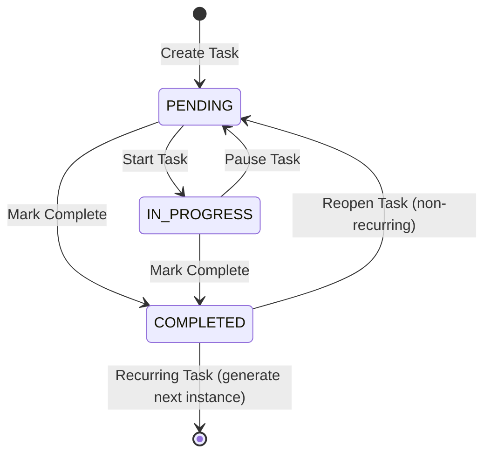

# Data Model: Intermediate and Advanced Todo Features

**Feature**: 003-intermediate-advanced-features
**Date**: 2025-12-30
**Purpose**: Define database schema extensions, entity relationships, validation rules, and state transitions

## Entity: Task (Extended)

### Overview
Extends existing `Task` entity from Phase II with new fields for priorities, tags, due dates, and recurrence patterns.

### Schema Definition

```python
from enum import Enum as PyEnum
from datetime import datetime, date
from sqlmodel import Field, SQLModel, Column, Enum as SQLModelEnum, ARRAY, String
from typing import Optional

class TaskPriority(str, PyEnum):
    """Task priority levels"""
    HIGH = "high"
    MEDIUM = "medium"
    LOW = "low"

class TaskStatus(str, PyEnum):
    """Task status (existing from Phase II)"""
    PENDING = "pending"
    IN_PROGRESS = "in_progress"
    COMPLETED = "completed"

class RecurrencePattern(str, PyEnum):
    """Recurrence frequency patterns"""
    DAILY = "daily"
    WEEKLY = "weekly"
    MONTHLY = "monthly"

class Task(SQLModel, table=True):
    """
    Task entity with Phase II fields + Phase II Part 2 extensions
    """
    # === EXISTING PHASE II FIELDS (unchanged) ===
    id: Optional[int] = Field(default=None, primary_key=True)
    user_id: str = Field(index=True, nullable=False)  # Better Auth user ID
    title: str = Field(max_length=200, nullable=False)
    description: str | None = Field(default=None, max_length=2000)
    status: TaskStatus = Field(
        default=TaskStatus.PENDING,
        sa_column=Column(SQLModelEnum(TaskStatus))
    )
    created_at: datetime = Field(default_factory=datetime.utcnow, nullable=False)
    updated_at: datetime = Field(
        default_factory=datetime.utcnow,
        sa_column_kwargs={"onupdate": datetime.utcnow}
    )
    completed_at: Optional[datetime] = Field(default=None)

    # === NEW PHASE II PART 2 FIELDS ===

    # Priority & Tags (Intermediate Features)
    priority: TaskPriority = Field(
        default=TaskPriority.MEDIUM,
        sa_column=Column(SQLModelEnum(TaskPriority)),
        description="Task priority level (high/medium/low)"
    )
    tags: list[str] = Field(
        default_factory=list,
        sa_column=Column(ARRAY(String(50))),
        description="User-defined category tags (max 50 chars each)"
    )

    # Due Dates & Reminders (Advanced Features)
    due_date: Optional[datetime] = Field(
        default=None,
        description="Task due date/time in UTC"
    )
    notification_sent: bool = Field(
        default=False,
        description="Track if due date notification has been sent"
    )

    # Recurring Tasks (Advanced Features)
    is_recurring: bool = Field(
        default=False,
        description="Whether task repeats on a schedule"
    )
    recurrence_pattern: Optional[RecurrencePattern] = Field(
        default=None,
        sa_column=Column(SQLModelEnum(RecurrencePattern)),
        description="Frequency of recurrence (daily/weekly/monthly)"
    )
    recurrence_end_date: Optional[date] = Field(
        default=None,
        description="Optional end date for recurrence (inclusive)"
    )
    parent_task_id: Optional[int] = Field(
        default=None,
        foreign_key="task.id",
        description="Reference to parent task if this is a recurring instance"
    )

    # Indexes defined in migration (see below)
```

### Field Validation Rules

| Field | Constraints | Validation Logic | Error Message |
|-------|-------------|------------------|---------------|
| `title` | 1-200 chars, non-empty | `len(title.strip()) > 0 and len(title) <= 200` | "Title must be between 1 and 200 characters" |
| `description` | 0-2000 chars | `len(description) <= 2000` if not None | "Description cannot exceed 2000 characters" |
| `priority` | Must be valid enum | Value in `[HIGH, MEDIUM, LOW]` | "Invalid priority. Must be high, medium, or low" |
| `tags` | Max 10 tags, each 1-50 chars, alphanumeric + hyphen/underscore, no duplicates | `len(tags) <= 10`, each tag matches `^[a-zA-Z0-9_-]{1,50}$`, case-insensitive uniqueness | "Tags must be 1-50 characters, alphanumeric with hyphens/underscores. Max 10 tags. No duplicates." |
| `due_date` | Must be in future or within 1 year past (for overdue) | `due_date >= now() - timedelta(days=365)` | "Due date cannot be more than 1 year in the past" |
| `recurrence_pattern` | Required if `is_recurring=True` | `is_recurring == False or recurrence_pattern is not None` | "Recurrence pattern required when task is recurring" |
| `recurrence_end_date` | Must be >= `due_date` if both set | `recurrence_end_date is None or due_date is None or recurrence_end_date >= due_date.date()` | "Recurrence end date must be on or after task due date" |
| `parent_task_id` | Must reference existing task owned by same user | Foreign key constraint + application-level check | "Invalid parent task reference" |

### Database Indexes

```sql
-- Existing index from Phase II
CREATE INDEX idx_tasks_user_id ON task (user_id);

-- New composite index for common filter queries
CREATE INDEX idx_tasks_user_status_priority ON task (user_id, status, priority);

-- GIN index for array containment queries on tags
CREATE INDEX idx_tasks_tags ON task USING GIN (tags);

-- B-tree index for due date range queries
CREATE INDEX idx_tasks_due_date ON task (due_date) WHERE due_date IS NOT NULL;

-- Index for recurring task parent lookups
CREATE INDEX idx_tasks_parent_task_id ON task (parent_task_id) WHERE parent_task_id IS NOT NULL;
```

### State Transitions

#### Task Status Transitions



**Transition Rules**:
1. **Create Task**: Always starts in `PENDING` status
2. **Mark Complete**:
   - Update `status = COMPLETED`
   - Set `completed_at = now()`
   - If `is_recurring == True`: Generate next instance (see Recurrence Logic)
3. **Reopen Task**: Only allowed if `is_recurring == False`
   - Reset `status = PENDING`
   - Clear `completed_at`
4. **Start Task**: `PENDING → IN_PROGRESS` (optional intermediate state)

#### Recurrence Instance Generation

**Trigger**: Task marked `COMPLETED` where `is_recurring == True`

**Logic**:
```python
def generate_next_recurring_instance(completed_task: Task) -> Task | None:
    """Generate next recurring task instance after completion"""

    # Check if recurrence should continue
    if not completed_task.is_recurring:
        return None

    if not completed_task.recurrence_pattern:
        return None

    # Calculate next due date
    next_due = calculate_next_due_date(
        current_due=completed_task.due_date or completed_task.completed_at,
        pattern=completed_task.recurrence_pattern
    )

    # Check recurrence end date
    if completed_task.recurrence_end_date and next_due.date() > completed_task.recurrence_end_date:
        return None  # Recurrence period ended

    # Create new task instance
    next_task = Task(
        user_id=completed_task.user_id,
        title=completed_task.title,
        description=completed_task.description,
        priority=completed_task.priority,
        tags=completed_task.tags.copy(),
        status=TaskStatus.PENDING,
        due_date=next_due,
        is_recurring=True,
        recurrence_pattern=completed_task.recurrence_pattern,
        recurrence_end_date=completed_task.recurrence_end_date,
        parent_task_id=completed_task.id,
        notification_sent=False
    )

    return next_task

def calculate_next_due_date(current_due: datetime, pattern: RecurrencePattern) -> datetime:
    """Calculate next due date based on recurrence pattern"""
    from datetime import timedelta
    from calendar import monthrange

    if pattern == RecurrencePattern.DAILY:
        return current_due + timedelta(days=1)

    elif pattern == RecurrencePattern.WEEKLY:
        return current_due + timedelta(weeks=1)

    elif pattern == RecurrencePattern.MONTHLY:
        # Handle month-end edge cases (e.g., Jan 31 -> Feb 28/29)
        next_month = current_due.month + 1 if current_due.month < 12 else 1
        next_year = current_due.year if current_due.month < 12 else current_due.year + 1
        max_day = monthrange(next_year, next_month)[1]
        next_day = min(current_due.day, max_day)

        return current_due.replace(year=next_year, month=next_month, day=next_day)

    return current_due  # Fallback (should not reach)
```

#### Notification State Management

**Trigger**: Foreground polling (every 60 seconds) checks for tasks with:
- `due_date <= now() + 5 minutes`
- `status != COMPLETED`
- `notification_sent == False`

**Logic**:
```python
def check_and_send_notifications(user_id: str) -> list[Task]:
    """Check for due tasks and send browser notifications"""
    now = datetime.utcnow()
    notification_window = now + timedelta(minutes=5)

    due_tasks = session.exec(
        select(Task).where(
            Task.user_id == user_id,
            Task.status != TaskStatus.COMPLETED,
            Task.due_date.between(now, notification_window),
            Task.notification_sent == False
        )
    ).all()

    return due_tasks

def mark_notification_sent(task_id: int):
    """Mark notification as sent to prevent duplicates"""
    task = session.get(Task, task_id)
    task.notification_sent = True
    session.add(task)
    session.commit()
```

**Reset Logic**: When `due_date` is updated, reset `notification_sent = False`

### Data Integrity Constraints

#### Application-Level Checks

1. **User Isolation**: All queries MUST filter by `user_id` from JWT token
   ```python
   # Correct
   task = session.exec(
       select(Task).where(Task.id == task_id, Task.user_id == authenticated_user_id)
   ).first()

   # WRONG - security vulnerability
   task = session.get(Task, task_id)
   ```

2. **Tag Normalization**:
   - Trim whitespace: `tag.strip()`
   - Lowercase for deduplication: `tag.lower()` comparison
   - Validate regex: `^[a-zA-Z0-9_-]{1,50}$`

3. **Recurring Task Orphan Prevention**:
   - If parent task is deleted, child tasks become standalone (set `parent_task_id = NULL`)
   - Cascade delete optional (configurable)

4. **Timezone Handling**:
   - All `due_date` values stored in UTC
   - Frontend converts to browser timezone for display
   - API accepts ISO 8601 with timezone info

#### Database-Level Constraints

```sql
-- Ensure recurrence pattern exists if is_recurring is true
ALTER TABLE task ADD CONSTRAINT chk_recurrence_pattern
CHECK (
    (is_recurring = false) OR (recurrence_pattern IS NOT NULL)
);

-- Ensure recurrence_end_date >= due_date if both are set
ALTER TABLE task ADD CONSTRAINT chk_recurrence_end_date
CHECK (
    (recurrence_end_date IS NULL) OR
    (due_date IS NULL) OR
    (recurrence_end_date >= DATE(due_date))
);

-- Ensure tags array has max 10 elements
ALTER TABLE task ADD CONSTRAINT chk_tags_max_count
CHECK (
    array_length(tags, 1) IS NULL OR array_length(tags, 1) <= 10
);
```

### Sample Data

```json
{
  "id": 42,
  "user_id": "user_abc123",
  "title": "Weekly team meeting preparation",
  "description": "Review agenda, compile status updates, prepare slides",
  "status": "pending",
  "priority": "high",
  "tags": ["work", "meetings", "recurring"],
  "due_date": "2025-12-31T14:00:00Z",
  "notification_sent": false,
  "is_recurring": true,
  "recurrence_pattern": "weekly",
  "recurrence_end_date": "2026-06-30",
  "parent_task_id": null,
  "created_at": "2025-12-30T10:00:00Z",
  "updated_at": "2025-12-30T10:00:00Z",
  "completed_at": null
}
```

### Migration Strategy

**Alembic Migration Steps**:

1. **Generate Migration**:
   ```bash
   alembic revision --autogenerate -m "Add priorities, tags, due dates, and recurrence to Task model"
   ```

2. **Review Auto-Generated Migration**:
   - Verify ENUM types created correctly
   - Confirm ARRAY column type for tags
   - Check index creation (GIN for tags, B-tree for others)

3. **Add Default Values** (if existing tasks present):
   ```python
   def upgrade():
       # Add columns with defaults for existing data
       op.add_column('task', sa.Column('priority', sa.Enum('high', 'medium', 'low'), server_default='medium'))
       op.add_column('task', sa.Column('tags', postgresql.ARRAY(sa.String(50)), server_default='{}'))
       op.add_column('task', sa.Column('is_recurring', sa.Boolean(), server_default='false'))
       # ... other columns ...

       # Create indexes
       op.create_index('idx_tasks_user_status_priority', 'task', ['user_id', 'status', 'priority'])
       op.create_index('idx_tasks_tags', 'task', ['tags'], postgresql_using='gin')
       # ... other indexes ...
   ```

4. **Apply Migration**:
   ```bash
   alembic upgrade head
   ```

5. **Rollback Plan** (if needed):
   ```bash
   alembic downgrade -1
   ```

### Data Access Patterns

#### Common Queries

1. **Get user's tasks with filters**:
   ```python
   query = select(Task).where(Task.user_id == user_id)

   if search_term:
       query = query.where(
           or_(Task.title.ilike(f"%{search_term}%"),
               Task.description.ilike(f"%{search_term}%"))
       )

   if priority_filter:
       query = query.where(Task.priority.in_(priority_filter))

   if tag_filter:
       query = query.where(Task.tags.contains(tag_filter))

   if status_filter:
       query = query.where(Task.status.in_(status_filter))

   query = query.order_by(Task.due_date.asc().nullslast(), Task.created_at.desc())

   tasks = session.exec(query).all()
   ```

2. **Get all unique tags for a user**:
   ```python
   result = session.exec(
       select(func.unnest(Task.tags))
       .where(Task.user_id == user_id)
       .distinct()
   ).all()
   ```

3. **Get overdue tasks**:
   ```python
   now = datetime.utcnow()
   overdue = session.exec(
       select(Task).where(
           Task.user_id == user_id,
           Task.status != TaskStatus.COMPLETED,
           Task.due_date < now
       )
   ).all()
   ```

4. **Get recurring task lineage**:
   ```python
   # Get all instances of a recurring task
   instances = session.exec(
       select(Task).where(
           or_(
               Task.id == original_task_id,
               Task.parent_task_id == original_task_id
           )
       ).order_by(Task.due_date.asc())
   ).all()
   ```

---

## Entity Relationships

```
User (Better Auth)
  |
  | 1:N (user_id foreign key)
  |
  v
Task
  |
  | 1:N (parent_task_id self-referential)
  |
  v
Task (recurring instances)
```

**Relationship Details**:
- **User → Task**: One-to-Many (one user has many tasks)
  - Enforced via `user_id` field + JWT authentication
  - No explicit foreign key to User table (Better Auth manages users)

- **Task → Task (Recurring)**: One-to-Many (parent task has many child instances)
  - Enforced via `parent_task_id` foreign key
  - Nullable (non-recurring tasks have `parent_task_id = NULL`)
  - Cascade behavior: ON DELETE SET NULL (children become standalone if parent deleted)

---

## Summary

- **New Fields**: 8 (priority, tags, due_date, notification_sent, is_recurring, recurrence_pattern, recurrence_end_date, parent_task_id)
- **New Indexes**: 4 (composite user/status/priority, GIN tags, due_date, parent_task_id)
- **New Enums**: 2 (TaskPriority, RecurrencePattern)
- **Backward Compatibility**: All new fields have defaults or are nullable (existing tasks unaffected)
- **Migration Tool**: Alembic with auto-generation + manual review
